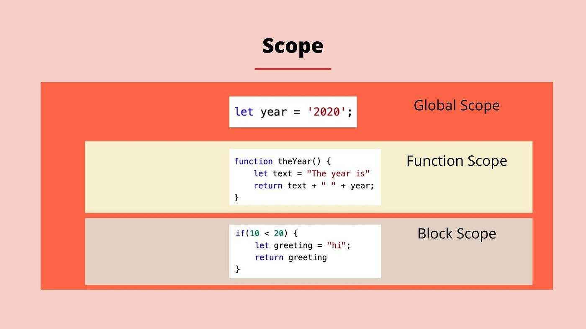

# Table of Contents scope Hoisting

## What is a scope in js ?
The scopeisthecurrentcontextofexecutioninwhichvaluesandexpressions
are"visible" orcanbereferenced. Ifa variableorexpressionisnotinthecurrent
scope, itwillnotbeavailableforuse. Scopescanalsobelayeredina hierarchy,
sothatchildscopeshaveaccesstoparentscopes, butnotviceversa.
>
## JavaScript has the following kinds of scopes:
        Global scope: The default scope for all code  running in script mode.
        >
       •Function scope: The scope created with afunction.
        >
       Block scope: This scope restricts the variable that is declared
       inside a specific block, from access by the outside of the block.
        >    
       •Module scope: The scope for code running in module mode.

   

   